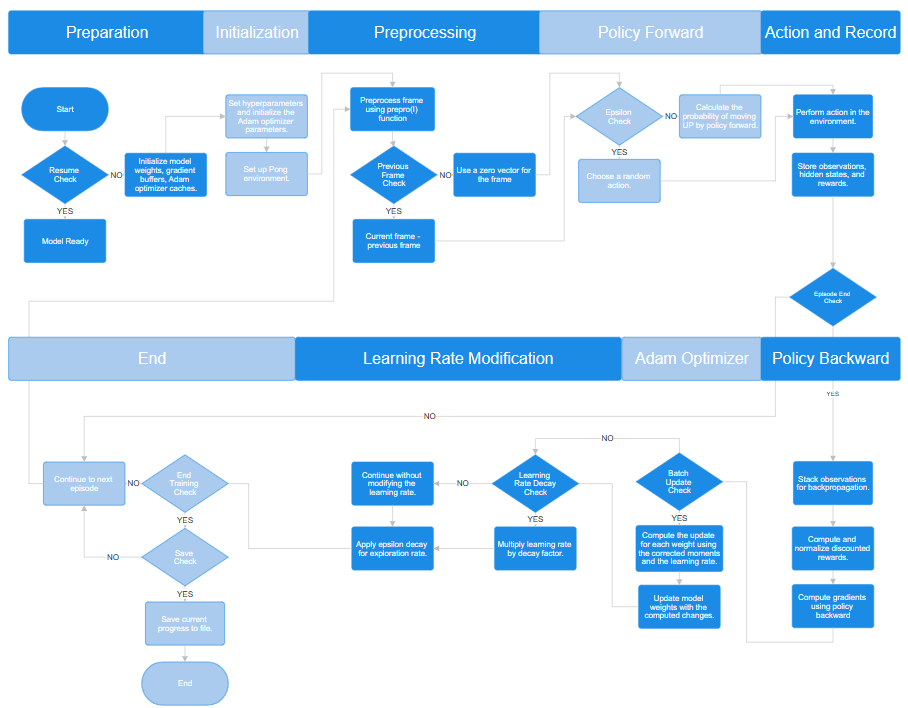

# SmartPong
## An implemented Pong AI using Policy Gradients by replicating Pong From Pixles by Andrej Karpathy

**Author**: Loc Nguyen

**Supervisor**: Dr. Rob Williams

### Neural Network Architecture
•	**Original**: Utilizes a simpler neural network with one hidden layer of 200 neurons.

•	**SmartPong**: Introduces a more complex architecture with two hidden layers, the first containing 200 neurons and the second 100 neurons. This additional layer can capture more complex patterns or strategies in the game, potentially leading to better performance.

### Activation Functions
•	**Original**: Uses ReLU (Rectified Linear Unit) as the non-linearity after the hidden layer.

•	**SmartPong**: Implements Leaky ReLU and layer normalization after each hidden layer. Leaky ReLU helps prevent the "dying ReLU" problem by allowing a small gradient when the unit is not active. Layer normalization standardizes the inputs to each layer, which can accelerate training and improve the final performance.

### Optimization Algorithm
•	**Original**: Employs RMSProp as the optimization technique.

•	**SmartPong**: Switches to the Adam optimizer, incorporating momentum to smooth out gradients over time and potentially improve convergence speed. It uses a more sophisticated approach to adjust the learning rate, which can lead to better performance in practice.

### Exploration Strategy
•	**SmartPong**: Incorporates an exploration strategy using the epsilon-greedy method, where the value of epsilon decreases over time. This method balances exploration of the environment with exploitation of the agent's current knowledge.

### Additional Features in SmartPong
•	**Learning Rate Decay**: Implements a decay in the learning rate over time, potentially leading to more stable convergence by making smaller adjustments as the agent improves.

•	**Discount Factor Adjustment**: Both scripts use a discount factor (gamma), but the test version introduces additional hyperparameters like learning rate decay and epsilon decay, providing finer control over the learning process.

### Implementation of Backpropagation
•	**Original**: Direct implementation of backpropagation with gradients being manually calculated and applied.

•	**SmartPong**: Also manually implements backpropagation but in a more complex neural network architecture, indicating a potentially more complex gradient calculation due to the additional layer.

### Exploration vs. Exploitation
•	**SmartPong**: More sophisticated handling of the exploration-exploitation dilemma with epsilon-greedy strategy. It starts with a high likelihood of random actions (exploration) and gradually increases the reliance on the model’s policy (exploitation).

## SmartPong Flowchart

  

